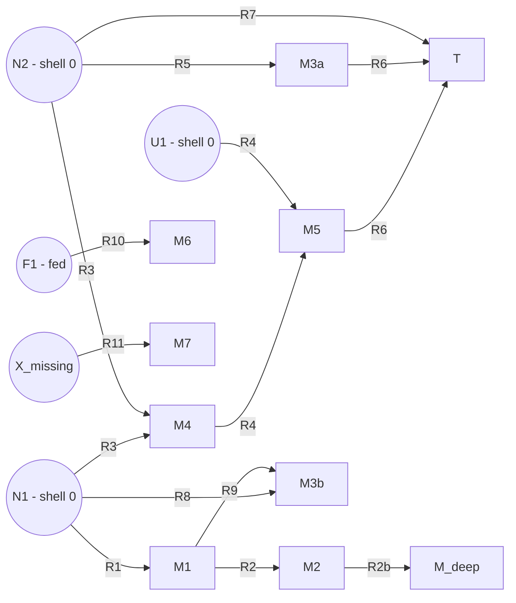

# Small-Cell Validation Fixture

**Purpose:** a hand-drawn synthetic metabolism where every shell number, cascade member, and pathway is pre-computable on paper. The companion tests under `tests/test_small_cell_*.py` assert every expected value, so any regression in `synthesize`, `traceback`, or `enumerate_pathways` fails loudly and points at the right module.

**Hermetic:** the fixture does not read anything under `data/` — changes to the real MetaCyc corpus have zero effect on these tests. See `tests/fixtures/small_cell.py`.

---

## Topology



Plain ASCII version:

```
  N1 ─ R1 ─> M1 ─ R2 ─> M2 ─ R2b ─> M_deep           (linear chain, shells 1/2/3)

  N1 ┐
     ├─ R3 ─> M4 ─ R4(+U1) ─> M5 ┐
  N2 ┘                            ├─ R6 ─> T         (route A via M5+M3a)
                                  │
  N2 ─ R5 ─> M3a ─────────────────┘

  N2 ─ R7 ─> T                                        (route B, direct)

  N1 ─ R8 ─> M3b  <─ R9 ─ M1                          (tied-shell: shorter wins)

  F1 ─ R10 ─> M6            (disabled unless F1 fed)
  X_missing ─ R11 ─> M7     (never fires)
```

---

## Ground truth — chemicals (base run, no feed)

| Chemical   | Shell    | How reached                                  |
|------------|----------|----------------------------------------------|
| N1, N2     | 0        | native                                       |
| U1         | 0        | universal                                    |
| M1         | 1        | R1                                           |
| M4         | 1        | R3                                           |
| M3a        | 1        | R5                                           |
| M3b        | 1        | R8 (shorter; R9 also produces it at shell 2) |
| T          | 1        | R7 (shorter; R6 also produces T at shell 3)  |
| M2         | 2        | R2                                           |
| M5         | 2        | R4                                           |
| M_deep     | 3        | R2b                                          |
| F1         | absent   | fed-only                                     |
| M6         | absent   | needs F1                                     |
| M7         | absent   | needs X_missing                              |
| X_missing  | absent   | never introduced                             |

When F1 is added to natives: F1 -> 0, M6 -> 1.

---

## Ground truth — reactions (base run)

| Rxn   | Substrates         | Products   | Shell  | Scenario |
|-------|--------------------|------------|--------|----------|
| R1    | N1                 | M1         | 1      | (a)      |
| R2    | M1                 | M2         | 2      | (a)      |
| R2b   | M2                 | M_deep     | 3      | (a)      |
| R3    | N1, N2             | M4         | 1      | (b)      |
| R4    | M4, U1             | M5         | 2      | (c)      |
| R5    | N2                 | M3a        | 1      | —        |
| R6    | M5, M3a            | T          | 3      | (d)      |
| R7    | N2                 | T          | 1      | (d)      |
| R8    | N1                 | M3b        | 1      | (f)      |
| R9    | M1                 | M3b        | 2      | (f)      |
| R10   | F1                 | M6         | —      | (g)      |
| R11   | X_missing          | M7         | —      | (e)      |

---

## Ground truth — Cascade for T

```
Cascade(T).reactions == {R7, R6, R4, R3, R5}
```

- R7 is a direct producer (R7: N2 -> T).
- R6 is also a direct producer (R6: M5 + M3a -> T).
- Pulling R6 into the cascade drags in the chain that makes its substrates:
  - M5 comes from R4 (M4 + U1 -> M5).
  - M4 comes from R3 (N1 + N2 -> M4).
  - M3a comes from R5 (N2 -> M3a).
- Recursion stops at shell-0 chemicals (N1, N2, U1).

---

## Ground truth — Pathways for T (correct behavior)

Two independent routes:

1. **Route B (direct):** `{R7}` — via `N2 -> T`.
2. **Route A (composite):** `{R3, R4, R5, R6}` — via `R3:{N1,N2}->M4`, `R4:{M4,U1}->M5`, `R5:{N2}->M3a`, `R6:{M5,M3a}->T`.

---

## Known bug: `synthesis_helper/pathways.py:78-80`

In `enumerate_pathways`, when a reaction has multiple non-native substrates, only the first is recursed on:

```python
# Recurse on the first non-native substrate
# (simplified — full enumeration would branch on all)
_backtrack(non_native[0], current_rxns, current_metabolites)
```

For R6, `non_native = [M5, M3a]`. Correct behavior: recurse on both branches and combine (cartesian product of sub-paths, one branch per non-native substrate). Current behavior: one pathway is returned containing R6 plus only one branch's upstream chain — the full `{R3, R4, R5, R6}` reaction set is never produced.

**Test:** `tests/test_small_cell_pathways.py::test_pathways_enumerates_both_complete_routes` is decorated `@pytest.mark.xfail(strict=True)`. When the bug is fixed, that test flips to XPASS and the suite fails — at that point, remove the decorator.

---

## Scenario ↔ test map

| Scenario                                     | Test file                             | Test name                                          |
|----------------------------------------------|---------------------------------------|----------------------------------------------------|
| (a) linear chain, shell propagation >2       | `test_small_cell_synthesize.py`       | `test_linear_chain_shells`                         |
| (b) multi-substrate                          | `test_small_cell_synthesize.py`       | `test_multi_substrate_shell`                       |
| (c) universal does not inflate shell         | `test_small_cell_synthesize.py`       | `test_universal_does_not_inflate_shell`            |
| (d-cascade) multi-producer target            | `test_small_cell_traceback.py`        | `test_cascade_for_T_contains_both_producers`       |
| (d-pathways) route A fully enumerated        | `test_small_cell_pathways.py`         | `test_pathways_enumerates_both_complete_routes` (xfail) |
| (d-pathways) route B robust                  | `test_small_cell_pathways.py`         | `test_pathways_finds_route_B`                      |
| (e) unreachable chemical                     | `test_small_cell_synthesize.py`       | `test_unreachable_chemical_absent`                 |
| (e-traceback) unreachable target raises      | `test_small_cell_traceback.py`        | `test_traceback_on_unreachable_raises`             |
| (f) tied shells                              | `test_small_cell_synthesize.py`       | `test_tied_shells_bfs_picks_shorter`               |
| (g) fed chemical                             | `test_small_cell_synthesize.py`       | `test_fed_chemical_enables_reaction`               |
| parser round-trip                            | `test_small_cell_pathways.py`         | `test_parser_roundtrip_tsv`                        |

---

## How to run

```bash
pytest tests/test_small_cell_synthesize.py tests/test_small_cell_traceback.py tests/test_small_cell_pathways.py -v
```

Expected: all green, with one **XFAIL** for the known bug at `pathways.py:78-80`.

---

## Edge cases beyond the primary small cell

The primary small cell covers the 7 main structural scenarios (a)–(g). Additional edge cases are covered by standalone inline-fixture tests in `tests/test_edge_cases.py`:

| Gap (previously identified) | Test |
|---|---|
| Self-referential reaction `R: A -> A` (matches MetaCyc rxn 88 pattern) | `test_self_referential_reaction_does_not_loop` |
| Reaction produces a shell-0 chemical (must not overwrite native's shell) | `test_product_already_in_shell_zero_is_not_overwritten` |
| Multi-product reaction `R: {A, B} -> {C, D}` | `test_multi_product_reaction_both_products_reachable` |
| Deep chain (20 shells) — BFS termination on long pathways | `test_synthesize_deep_chain_20_shells` |
| Zero-substrate reaction (pins current `all([])==True` behavior) | `test_empty_substrate_reaction_enables_at_shell_one` |
| Zero-product reaction (no-op) | `test_empty_product_reaction_is_noop` |
| Determinism — same inputs, same shell map | `test_synthesize_is_deterministic` |
| Scale smoke test — 100-chemical corpus completes | `test_synthesize_handles_100_chemical_corpus` |
| Chemical-level cycle in cascade (B ↔ C) — enumerate_pathways must not loop | `test_enumerate_pathways_handles_chemical_level_cycle` |
| `max_pathways` cap enforcement on deep cascades | `test_enumerate_pathways_respects_max_pathways_cap_in_deep_cascade` |
| Model invariant: Chemical equality is by id only | `test_same_id_different_inchi_treated_as_same_chemical` |
| Parser silently drops unknown substrate ids (documented risk) | `test_parse_reactions_silently_drops_unknown_substrate_ids` |
| `parse_metabolite_list` loose-InChI match covers stereoisomers | `test_parse_metabolite_list_loose_match_adds_all_stereoisomers` |
| `parse_metabolite_list` case-insensitive name fallback | `test_parse_metabolite_list_name_match_fallback` |

These use minimal per-test inline fixtures rather than the shared small cell — each one isolates exactly the structural property under test. Two behaviors are deliberately pinned as current-behavior assertions (zero-substrate reactions enabling, parser silently dropping unknown ids); if either should change, the failing test will flag the need for a conscious decision.

## Cascade algorithm invariants

`traceback()` is the cascade algorithm — a backward BFS from target that collects every reaction (directly or transitively) able to produce it. These invariants are tested in `tests/test_edge_cases.py`:

| Cascade invariant | Test |
|---|---|
| Target is shell-0 native → cascade is empty | `test_traceback_on_native_chemical_returns_empty_cascade` |
| Deep cascade (8-shell chain) includes full transitive closure | `test_traceback_deep_cascade_includes_full_chain` |
| Diamond dependency: shared ancestor appears exactly once in the cascade set | `test_traceback_diamond_dependency_deduplicates_shared_ancestor` |
| Two independent reactions producing the same target from the same substrate are both included | `test_traceback_shared_substrate_two_producers_of_target` |
| Disjoint subgraph: traceback of one target must not pull in the other's reactions | `test_traceback_excludes_disjoint_subgraph` |
| Cross-algorithm invariant: every reaction in every pathway must be in the cascade | `test_cascade_is_superset_of_all_pathway_reactions` |

## Universal invariants (impl-agnostic properties)

`tests/test_invariants.py` contains property tests that apply to **any** correct implementation of `synthesize` and `traceback`. These are the formal definitions of what the algorithms mean — they don't care how the implementation is structured, only that the output satisfies the invariants. When a teammate ships a new implementation, these tests catch spec violations without anyone needing to know the internals.

**`synthesize()` invariants:**

| Invariant | Test |
|---|---|
| Every native and universal is at shell 0 | `test_invariant_natives_and_universals_all_at_shell_zero` |
| Shells are non-negative integers (reactions start at 1, chemicals at 0) | `test_invariant_shells_are_non_negative_integers` |
| `shell(R) == max(shell(s) for s in R.substrates) + 1` — the BFS defining equation | `test_invariant_reaction_shell_equals_max_substrate_shell_plus_one` |
| All products of enabled reactions are reachable | `test_invariant_all_products_of_enabled_reactions_are_reachable` |
| All substrates of enabled reactions are reachable | `test_invariant_all_substrates_of_enabled_reactions_are_reachable` |
| Every non-native chemical has a producer at the matching shell | `test_invariant_every_non_native_chemical_has_a_producer_at_matching_shell` |
| Completeness: no unchosen reaction has all substrates reachable (fixed-point) | `test_invariant_no_disabled_reaction_has_all_substrates_reachable` |
| Every reachable chemical can be successfully tracebacked | `test_invariant_every_reachable_chemical_can_be_tracebacked` |

**Boundary inputs:**

| Case | Test |
|---|---|
| No reactions → only natives present | `test_synthesize_with_no_reactions_returns_only_natives` |
| No seeds at all → empty hypergraph | `test_synthesize_with_no_natives_or_universals_is_empty` |
| Universal-only seed pool | `test_synthesize_with_only_universals_seeds_shell_zero` |
| Chemical in both native and universal sets | `test_synthesize_native_and_universal_overlap_is_still_shell_zero` |

**cascade (traceback) invariants:**

| Invariant | Test |
|---|---|
| Cascade reactions ⊆ enabled reactions (no phantoms) | `test_invariant_cascade_reactions_are_subset_of_hypergraph` |
| No orphan reactions in cascade (every reaction produces something useful) | `test_invariant_cascade_every_reaction_produces_something_in_transitive_closure` |
| Closure: every non-native substrate has a producer within the same cascade | `test_invariant_cascade_closed_under_substrate_backtracking` |
| Cascade of non-native target contains a reaction producing that target | `test_invariant_cascade_target_is_produced_or_is_native` |
| Monotonicity: `Cascade(M) ⊆ Cascade(T)` when M is an intermediate of T | `test_invariant_cascade_is_monotonic_under_intermediate_containment` |
| Cascade of shell-0 target is empty | `test_invariant_cascade_of_shell_zero_target_is_empty` |
| Cascade of unreachable target raises `ValueError` | `test_invariant_cascade_unreachable_target_raises` |

**End-to-end integration:**

| Scenario | Test |
|---|---|
| Full pipeline parse → synthesize → traceback produces same result as in-memory fixture | `test_end_to_end_parse_synthesize_traceback` |

## Updating the fixture

Only edit the ground truth above when you intentionally change the small-cell topology itself (i.e., add/remove a reaction or chemical in `tests/fixtures/small_cell.py`). Changes to real MetaCyc data under `data/` must NOT require any update here — if they do, the fixture has leaked its isolation.
